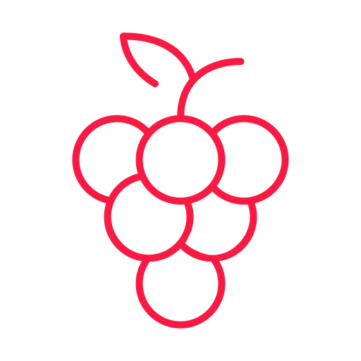

<body background="images/grapeWhite.png">
# Valleys_Tech

    
    <h2 align="center">🍇 Uma solução moderna para uma arte milenar </h2>

 

## Acordo de equipe

• Reuniões serão sempre iniciadas as terça-feiras às 20:00.

• Perante a necessidade de tempo, será discutida se há demanda de uma reunião ao sábado da respectiva semana. Neste mesmo debate será definido o horário de encontro.

• Após cada reunião, será registrado o conteúdo discutido e definido com os integrantes presentes na reunião (esclarecimentos, direcionamentos, eventuais dúvidas e   retrospectiva da visão geral do projeto).

• Todos requisitos serão desenvolvidos por duplas, exemplo: Numa demanda de uma tela de login, serão elegidas duplas, cada dupla atenderá ao serviço e nas reuniões subsequentes será eleito o trabalho definitivo pelo grupo e discutida melhorias no código desenvolvido. As duplas serão rotativas, baseadas em dificuldades perante o conteúdo exigido, sendo um integrante com mais facilidade no conteúdo e outro com mais dificuldade.

• As atas serão registradas em cada tarefa do status de “Reuniões“ do Trello.

• Toda e qualquer decisão tomada pelo grupo deve ser democrática.

• Durante a tomada de decisão nas reuniões, os integrantes não presentes na mesma não terão poder de voto.

• Atrasos serão registrados em ata, sendo recomendada a presença na reunião com 15 minutos de antecedência em relação ao horário estipulado.

• Atrasos e faltas serão divididos em atrasos e faltas justificados e não justificados. Em caso de falta não justificada, será conversado com o integrante e a atitude não deverá ser repetida, em caso reincidência a discussão será levada a equipe socioemocional, o mesmo se aplica na reincidência tripla em atrasos não justificados.

 

## Integrantes
🕹️ <a href="https://github.com/Eggberto0">Erick Ribeiro</a>  
👾 <a href="https://github.com/henriquejm98">Henrique Mosca</a> 
🧠 <a href="https://github.com/Luka-Caetano">Luka Caetano</a> 
😎 <a href="https://github.com/MarcceloSpinelli">Marccelo Spinelli</a> 
🤓 <a href="https://github.com/JRamonPere">Ramon Pereira</a> 
🤖 <a href="https://github.com/vitoramosc">Vitor Ramos</a> 
</body>
